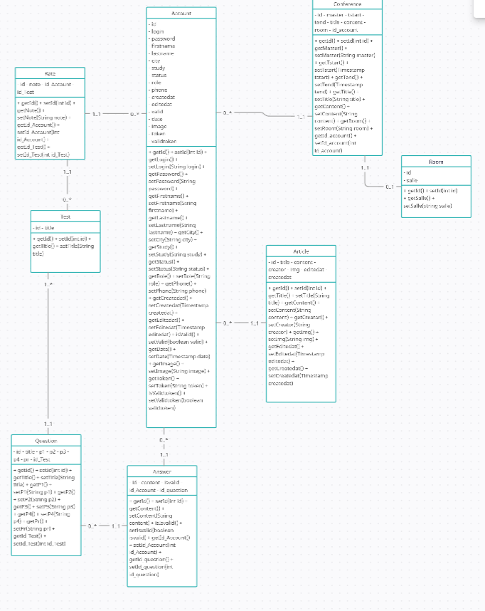

# 501_FRONT


# Dockerfile for React.js (Vite)

Dockefile and docker-compose for build and run react.js (by vite) project in Docker for Production

## Usage

Clone Repository and Copy Dockerfile and docker-compose.yaml to Project root & Run :

```bash
  docker-compose up -d
```
# Sommaire

- [Livrable 1 : Phase de cadrage](#livrable1)
  - [Répartition des tâches](#répartition-des-tâches)
  - [Carte Mentale](#carte-mentale)
  - [Diagramme Use Case](#diagramme-use-case)
  - [Diagramme d'activités](#diagramme-dactivités)
  - [Diagramme de classes](#diagramme-de-classes)
- [Livrable 2](#livrable--l401_2)
  - [Maquette](#maquette)
- [Livrable 3](#livrable--l401_3)
  - [Maquettes de l'application](#maquettes-de-lapplication)
- [Livrable 4](#livrable_4)
  
- [Livrable 5](#livrable_5)


# Livrable 1 : Phase de cadrage

<h2 id="répartition-des-tâches">Répartition des tâches</h2>

https://trello.com/b/DEcimwUf/sa%C3%A9501


<h2 id="carte-mentale">Carte Mentale</h2>

Liens: [Carte mentale](https://www.figma.com/design/722BNI8EQTC8RiOg9lHHb9/Carte-mentale?node-id=0-1&node-type=canvas&t=yKDDfEvuP5oq29Gm-0)


<h2 id="diagramme-use-case">Diagramme Use Case</h2>

Liens: [Use cases](https://app.creately.com/d/UO7DATaUb6V/edit)


<h2 id="diagramme-de-classes">Diagramme de classes</h2>

Liens: [Diagrame de classes ](https://app.creately.com/d/8IhlOzrDdw2/edit)


# Architecture

Liens: [Architecture](https://app.creately.com/d/tdS0ZVhEZFl/edit)


# Structuration hiérarchique

Liens: [Structuration hiérarchique](https://app.creately.com/d/smxBCvPkaN7/edit)
